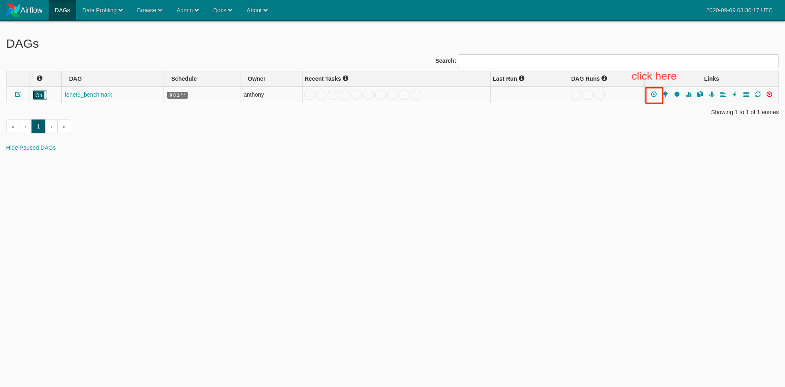

# ml2_takehome

## Objective

Implement Lenet5 with Libtorch [**done**]
* source code : [train_server/app/src](https://github.com/anthony0727/ml2_takehome/tree/master/train_server/app/src)
* code review : [wiki](https://github.com/anthony0727/ml2_takehome/wiki/Code-Review)

---

Additionally, I'm intending to advance the project to some extent

Which inlcudes:

* Benchmark Performance 
  * training time: Libtorch vs Pytorch vs Tensorflow [**done**]
  * inference TPS: pytroch/torchserve(ts) [**undone**] vs tensorflow/serving(tfs) [**done**] 

* Orchestration [**done**]
  * automate ml lifecycle with Apache Airflow

* Dockerize [**done**]
  * all logics are modularized with docker container

* If time allows, gather all models around and monitor them with tensorboard [**undone**]

## Usage

### Training

1. open airflow 

url : http://ec2-15-165-35-168.ap-northeast-2.compute.amazonaws.com:8080

2. click play button



task graph


monitor log


gantt


### Inference

open [jupyter notebook](https://colab.research.google.com/github/anthony0727/ml2_takehome/blob/master/notebook/lenet5_benchmark.ipynb) or `/notebook/lenet5_benchmark.ipynb`

Followings are covered : 

* sample requests to each server
* benchmark with apache benchmark(ab)

### build & run

url : http://ec2-3-35-42-27.ap-northeast-2.compute.amazonaws.com

|                    | port                                     |
|--------------------|------------------------------------------|
| airflow            | 8080: admin                              |
| torchserve         | 8081: Management API 8082: Inference API |
| tensorflow/serving | 8500: gRPC 8501: REST API                |

prerequisites :

* docker
* docker-compose

build & run :
```Shell
git clone https://github.com/anthony0727/ml2_takehome.git

# build train server image
cd ml2_takehome/train_server
build . -t train_server

# run airflow, torchserve, tfs servers
cd ml2_takehome
docker-compose up -d
```

## Architecture


## Modeling

Lenet5 is implemented in 3 versions. libtorch, pytorch, tensorflow

All models are to be implemented in same conditions

Layers

| layer  | kind | num filter | filter size | stride | padding |
|--- |--- |----| ----|----|----|
| c1 |conv| 6   | (5,5) | 1  | valid |
| s2 |pooling| --- | (2,2) | 2  | valid | 
| c3 |conv| 16  | (10,10) | 1 | valid |
| s4 |pooling| --- | (2,2) | 2 | valid |
| c5 |conv| 120  | (5,5) | 1  | valid |
| f6 |dense| 84   | --- | ---  | --- |
| OUT | softmax | 10 |  --- | --- | --- |


Optimizer : Adam

* learning rate: 0.01
* beta1: 0.9
* beta2: 0.999
* epsilon: small

## Code Review

Since this project is mainly focused on implementation of Lenet5 with Libtorch,

Libtorch C++ code is reviewed [here](https://github.com/anthony0727/ml2_takehome/wiki/Code-Review)

## Dev Note

having trouble with loading TorchScript generated model to torchserve

```
2020-09-04 12:36:07,574 [INFO ] W-9003-lenet5_1.0-stdout org.pytorch.serve.wlm.WorkerLifeCycle - torch.nn.modules.module.ModuleAttributeError: 'RecursiveScriptModule' object has no attribute 'forward'
```

why torchserve cannot recognize model?

looking into model loading logic in torchserve, still can't figure out why

## Reference

torchserve: 
* https://github.com/pytorch/serve
* https://towardsdatascience.com/deploy-models-and-create-custom-handlers-in-torchserve-fc2d048fbe91

tensorflow/serving:
* https://www.tensorflow.org/tfx/guide/serving

docker.sock
* https://www.digitalocean.com/community/questions/how-to-fix-docker-got-permission-denied-while-trying-to-connect-to-the-docker-daemon-socket

lenet:
* http://yann.lecun.com/exdb/publis/pdf/lecun-01a.pdf

airflow:
* https://airflow.apache.org/docs/stable/_api/airflow/operators/docker_operator/index.html
